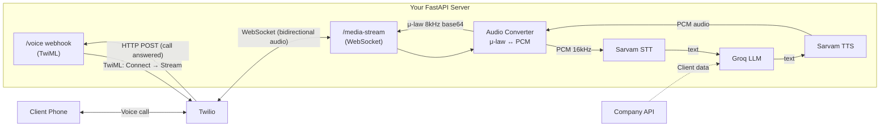

# StockMarketVoice — Analysis

## Current Project State

The project is a **fresh scaffold** — all service directories (`twilio_services/`, `sarvam_services/`, `groq_services/`) contain only README placeholders. `main.py` has a single import (`from fastapi import FastAPI`) with no app instance or routes. You have the right dependencies listed in `requirements.txt`.

---

## What You're Building

A **headless voice AI service** (no UI) with two call flows:

| Flow | Trigger | Direction | Description |
|------|---------|-----------|-------------|
| **Automated daily call** | Scheduled (cron/scheduler) | Outbound → Client | Fetches client data from company API, calls each client, delivers today's investment summary |
| **On-demand inquiry** | Client dials your Twilio number | Inbound → Server | Client asks questions about their investments, gets AI-powered answers |

Both flows share the same **bidirectional voice pipeline** once the call is connected.

---

## Architecture Overview



---

## The Real-Time Audio Pipeline (Core Problem)

This is the heart of the project. Here's what happens for every utterance:

### Inbound (Client speaks → AI processes)

```
Client speaks
  → Twilio captures audio
  → Sends 20ms chunks as base64-encoded μ-law (8kHz) over WebSocket
  → Your server decodes base64 → μ-law bytes
  → Convert μ-law 8kHz → PCM 16-bit 16kHz (for best STT accuracy)
  → Stream PCM chunks to Sarvam STT (WebSocket)
  → Sarvam returns transcribed text
  → Text + context → Groq LLM (streaming chat completion)
  → LLM response text → Sarvam TTS (WebSocket)
  → TTS returns PCM audio chunks
  → Convert PCM → μ-law 8kHz → base64 encode
  → Send back through Twilio WebSocket as media messages
  → Client hears the response
```

### Audio Format Conversion (Critical Detail)

| Direction | From | To | Method |
|-----------|------|----|--------|
| Twilio → Sarvam STT | μ-law 8kHz (base64) | PCM 16-bit 16kHz | `audioop.ulaw2lin()` + resample |
| Sarvam TTS → Twilio | PCM 16-bit (Sarvam output) | μ-law 8kHz (base64) | Resample + `audioop.lin2ulaw()` + base64 |

> [!IMPORTANT]
> **Audio format mismatch is the #1 source of bugs** in Twilio Media Stream projects. Twilio sends/expects `audio/x-mulaw` at 8kHz. Sarvam works best with `PCM 16-bit at 16kHz`. You must convert in both directions.

---

## Tech Stack Integration Details

### 1. Twilio Media Streams

**What it does**: Gives you a raw, real-time WebSocket pipe to the phone call audio.

**Key concepts**:
- **`<Connect><Stream>`** — TwiML verb for **bidirectional** audio (you need this)
- **`streamSid`** — Unique identifier for each stream, needed when sending audio back
- **Events received**: `start`, `media`, `mark`, `stop`
- **Sending audio back**: JSON message with `event: "media"`, the `streamSid`, and base64-encoded μ-law payload
- **`clear` event** — Clears the audio buffer (essential for barge-in / interruption)
- **`mark` event** — Track when sent audio finishes playing

**For outbound calls**: Use `client.calls.create()` with a `url` parameter pointing to your `/voice` webhook that returns `<Connect><Stream>` TwiML.

**For inbound calls**: Configure your Twilio phone number's webhook to point to your `/voice` endpoint.

### 2. Sarvam AI (STT + TTS)

**STT (Speech-to-Text)**:
- Streaming via WebSocket: `wss://api.sarvam.ai/...`
- Accepts WAV or raw PCM (`pcm_s16le`)
- Supports Indian languages + English (Indian accent)
- Requires `api-subscription-key` header
- Best accuracy at 16kHz sample rate

**TTS (Text-to-Speech)**:
- Streaming via WebSocket: `wss://api.sarvam.ai/...`
- Send config message first (language, speaker voice)
- Receives audio chunks in real-time
- Model: `bulbul:v3`

**REST endpoints** (alternative for non-streaming):
- `POST /speech-to-text` — batch transcription
- `POST /text-to-speech` — batch synthesis

### 3. Groq LLM

- Model: `llama-3.3-70b-versatile` (or latest available)
- Use `AsyncGroq` client for async FastAPI compatibility
- Stream responses with `stream=True` for minimum latency
- Pipe streaming tokens directly into Sarvam TTS for lowest end-to-end latency

---

## Two Call Flows in Detail

### Flow 1: Automated Outbound Call

```mermaid
sequenceDiagram
    participant Scheduler
    participant Server as FastAPI Server
    participant API as Company API
    participant Twilio
    participant Client as Client Phone
    participant AI as STT+LLM+TTS Pipeline

    Scheduler->>Server: Trigger at scheduled time
    Server->>API: Fetch client list + investment data
    API-->>Server: Client data (phone, portfolio)
    loop For each client
        Server->>Twilio: calls.create(to=client_phone, url=/voice)
        Twilio->>Client: Ring ring...
        Client->>Twilio: Answers
        Twilio->>Server: POST /voice
        Server-->>Twilio: TwiML <Connect><Stream url="/media-stream">
        Twilio<-->Server: WebSocket established
        Server->>AI: Generate opening message with client data
        AI-->>Server: TTS audio
        Server->>Twilio: Send audio (investment summary)
        Note over Client,AI: Bidirectional conversation begins
    end
```

### Flow 2: Inbound On-Demand Call

```mermaid
sequenceDiagram
    participant Client as Client Phone
    participant Twilio
    participant Server as FastAPI Server
    participant API as Company API
    participant AI as STT+LLM+TTS Pipeline

    Client->>Twilio: Calls your Twilio number
    Twilio->>Server: POST /voice
    Server-->>Twilio: TwiML <Connect><Stream url="/media-stream">
    Twilio<-->Server: WebSocket established
    Server->>AI: Generate greeting
    AI-->>Server: TTS audio
    Server->>Twilio: Send greeting audio
    Note over Client: "Hi, I'm your investment assistant..."
    Client->>Twilio: Speaks question
    Twilio->>Server: Audio stream
    Server->>AI: STT → LLM → TTS
    Note over Client: Identifies caller (from Twilio caller ID)
    Server->>API: Fetch caller's investment data
    API-->>Server: Portfolio data
    Note over Client,AI: Bidirectional conversation continues
```

---

## Key Challenges & Considerations

### 1. Latency
The pipeline has 4 network hops per turn: **Twilio → STT → LLM → TTS → Twilio**. To keep it conversational:
- Stream everything (don't wait for full STT before calling LLM)
- Use Groq's streaming mode to pipe tokens into TTS as they arrive
- Use Sarvam's streaming TTS to send audio chunks as they're generated

### 2. Barge-In (User Interrupts the Bot)
When the user starts speaking while the bot is talking:
- Send a `clear` event to Twilio to stop current playback
- Discard any pending TTS audio
- Start processing the new user input

### 3. Silence Detection / End-of-Utterance
You need to decide when the user has finished speaking:
- Sarvam STT streaming may provide final vs. interim transcriptions
- Alternatively, implement VAD (Voice Activity Detection) on the audio stream

### 4. Caller Identification (Inbound Calls)
- Twilio provides the caller's phone number (`From` field) in the webhook
- Use this to look up the client in your company API and load their portfolio context

### 5. Concurrent Calls
- For automated daily calls with many clients, you'll make multiple calls simultaneously
- Each call = 1 WebSocket connection + STT/TTS/LLM sessions
- FastAPI with `asyncio` handles this well, but be mindful of API rate limits

### 6. Error Handling
- What happens if Sarvam STT/TTS goes down mid-call?
- What if Groq rate-limits you during peak?
- Need graceful fallbacks (e.g., "I'm having trouble, please try again later")

---

## Recommended Implementation Order

> [!TIP]
> Start with the simplest end-to-end flow first, then add complexity.

| Phase | What to Build | Why |
|-------|--------------|-----|
| **Phase 1** | Twilio WebSocket connection — accept an inbound call, receive audio chunks, echo them back | Proves the Twilio Media Stream pipeline works |
| **Phase 2** | Add Sarvam STT — convert μ-law→PCM, stream to Sarvam, get text back | Proves audio conversion + STT works |
| **Phase 3** | Add Groq LLM — take transcribed text, get AI response | Proves the conversation logic works |
| **Phase 4** | Add Sarvam TTS — convert text→speech, convert PCM→μ-law, send back through Twilio | Completes the full bidirectional loop |
| **Phase 5** | Add outbound calling — `client.calls.create()` with scheduler | Adds the automated daily call flow |
| **Phase 6** | Add barge-in, context management, error handling | Polish for production |

---

## Environment Variables Needed

```env
# Twilio
TWILIO_ACCOUNT_SID=
TWILIO_AUTH_TOKEN=
TWILIO_PHONE_NUMBER=

# Sarvam AI
SARVAM_API_KEY=

# Groq
GROQ_API_KEY=

# Server
SERVER_URL=  # Your ngrok/public URL for Twilio webhooks
```

---

## Open Questions for You

1. **Language**: Will the calls be in English, Hindi, or multilingual? This affects Sarvam STT/TTS configuration.
2. **Company API**: What does the client data API look like? REST? What fields do you get? (phone number, name, portfolio summary, etc.)
3. **Scheduling**: How do you want to trigger the daily calls? Simple cron? APScheduler? External trigger?
4. **Caller ID for inbound**: Can you match the incoming phone number to a client in your company API?
5. **Call duration**: Any limits on how long a call can last?
